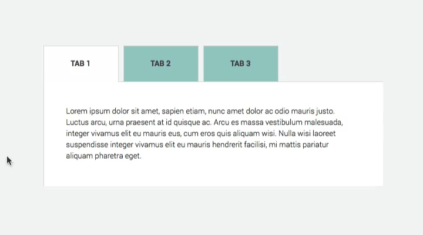

# ♡ NAVEGACIÓN  CON  TABS ♡

Las tabs nos sirven para agrupar contenido similar usando solo un espacio.

Algo así:

Replicar esa funcionalidad usando DOM y CSS. (No agregar efectos "bonitos", únicamente enfocarse en funcionalidad)
